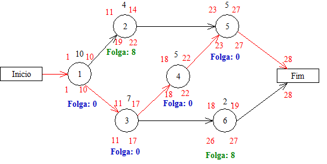

### Requisitos
Fazer um programa que receba uma tabela de atividades, duração e precedentes e monte o grafo de PERT/CPM, identificando o caminho crítico e as folgas nas atividades.

Utilizar a notação de aula, com tempo máximo e mínimo para inicio e fim das atividades, com a atividade sendo representado pelos vértices do grafo, conforme exemplo a seguir.

#### Exemplo:

| Atividades | Duração | Precedente |
|:----------:|:-------:|:----------:|
|      1     |    10   |            |
|      2     |    4    |      1     |
|      3     |    7    |      1     |
|      4     |    5    |      3     |
|      5     |    5    |     2,4    |
|      6     |    2    |      3     |

